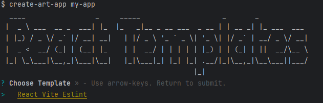

CREATE ART APP
=================

Create Art App CLI

[](https://github.com/Artbal95/create-art-app)
[](https://www.npmjs.com/package/create-art-app)
[](https://www.npmjs.com/package/create-art-app)
[](https://github.com/Artbal95/create-art-app/blob/master/package.json)
[](https://github.com/Artbal95/create-art-app/blob/master/package.json)

<!-- toc -->
* [Usage](#usage)
* [Templates](#Templates)
<!-- tocstop -->
# Usage
<!-- usage -->
```sh-session
$ npx create-react-app my-app
running command...
```

```sh-session
Choose your template and press Enter
If you want to create in the exist folder instead of the folder name, put a dot
$ npx create-react-app .
```
<!-- usagestop -->

# Templates

* React Vite Eslint
